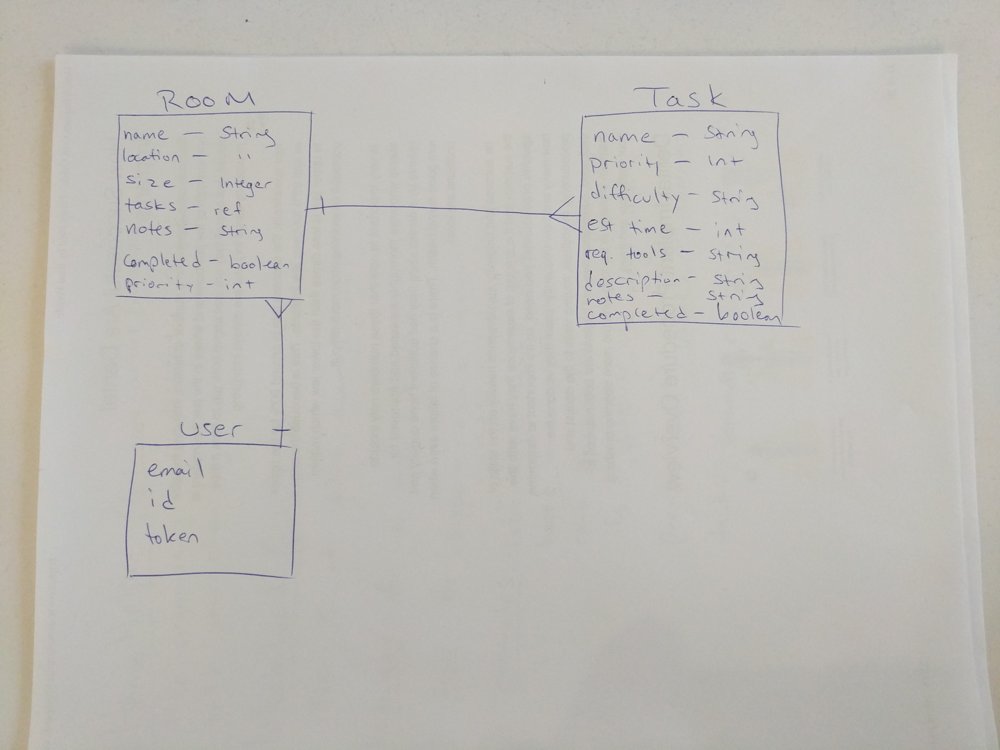

# Home*Helper* API ReadME

Version: 1.0

### Technologies Used:
Ruby on Rails, Ruby, PostgreSQL, Heroku, cURL

### Project Links
**Client (Front End) -**
[Deployed Client](https://wbounas.github.io/homehelper-client)
| [GitHub Client Repo](https://github.com/wbounas/homehelper-client)

**API (Back End) -**
[Deployed API](https://homehelper-api.herokuapp.com)
| [GitHub API Repo](https://github.com/wbounas/homehelper-client)

### About
Home*Helper* is a web application that helps users organize the tasks they need to complete in order to have the home they truly deserve! The basis of the idea came from both my growth as a web developer, and also my personal need for organizing my home. While at first the task seems insurmountable, it starts to become more achievable as you break down the ultimate goal into smaller, more reachable goals that you can accomplish one by one.

### Dev Notes *(version 1.0)*
This was my first web app built using a front-end framework. At GA-WDI in Boston, we were taught Ember.JS for our last unit of the course, and I decided it would be a great challenge for myself to A. use Ember and B. to build an API with 2 resources, as I was unable to achieve this during our 2nd project week, where we were focusing on building a Ruby on Rails API along with a front-end client built with JS, HTML, and CSS.

This was a great learning experience for me, but ultimately the app at this stage is not where I want it to be. The UX is something that will need to be improved dramatically in order to achieve the vision for that app that I have. However, I think it is very achievable in a short amount of time! Also, getting familiar with the concept of a front-end framework proved to be very valuable, and although I do still have a long way to go, I have made some important first steps in the journey.

### Future Iterations
- Add tasks to a room from the room view
- Break down current components into smaller, more re-usable components
- Create uniform styling across the app for consistency and overall better UX
- Provide a leaderboard that shows who has accomplished the most tasks on the app
- Provide a 'tweet' feature for tasks that have been accomplished
- Provide an 'SMS' feature for tasks that are not completed, but the user may need assistance with
- Add search functionality for user's tasks and rooms

## Catalog of Routes
### **API End-Points**

| HTTP Verb | URI Pattern         | Controller#Action |
|--------|------------------------|-------------------|
| post   | `/sign-up`             | `User#signup`    |
| post   | `/sign-in`             | `User#signin`    |
| delete | `/sign-out/:id`        | `User#signout`   |
| patch  | `/change-password/:id` | `User#changepw`  |
| post   | `/tasks`         | `Task#create`  |
| get    | `/tasks/`        | `Task#index` |
| get    | `/tasks/:id`     | `Task#show` |
| delete | `/tasks/:id`     | `Task#destroy` |
| patch  | `/tasks/:id`     | `Task#update` |
| post   | `/rooms`         | `Room#create`  |
| get    | `/rooms/`        | `Room#index` |
| get    | `/rooms/:id`     | `Room#show` |
| delete | `/rooms/:id`     | `Room#destroy` |
| patch  | `/rooms/:id`     | `Room#update` |

#### [Planning Materials](planning)

## Entity Relationship Diagram

